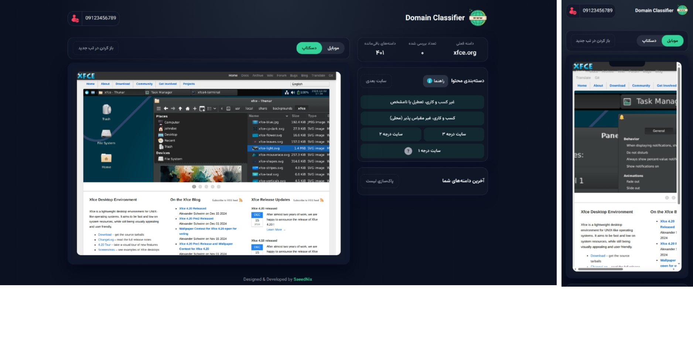

# DomainClassifier — Persian Domain Classification Tool

A high-performance, single-page domain classification tool with live iframe preview — built entirely with **vanilla JavaScript, CSS3, and minimal PHP**. Zero external dependencies.


_Live demo available privately upon request_

## Features

- Phone-based user login (no SMS required) + hidden admin mode
- Live **iframe preview** with instant mobile/desktop switching
- Dynamic classification using default or custom categories
- Fast random domain selection with internal queue
- Per-user history (last 30 entries)
- Persistent shared storage via JSON (`data/data.json`)
- **Admin-only** export results as **JSON** or **formatted TXT** (per-user & global)
- Smart viewport-aware iframe height using `visualViewport` API
- Fully responsive + native dark mode
- Pure vanilla JS — no frameworks, no build tools

## Tech Stack

- Frontend: Vanilla JavaScript (ES6+) + CSS3 (Grid, Flexbox, Custom Properties)
- Backend: Single PHP file with JSON file storage
- Font: Vazirmatn (Persian-optimized)

## Project Structure

```
├── index.html
├── app.js          # Core logic
├── styles.css      # Responsive design
├── api.php         # JSON endpoint (excluded)
├── data/           # Auto-generated storage (excluded)
└── assets/         # Fonts, icons, images
```

## Security & Privacy

- `api.php` and `data/` are excluded from this public repository
- Export functionality restricted to hidden admin mode
